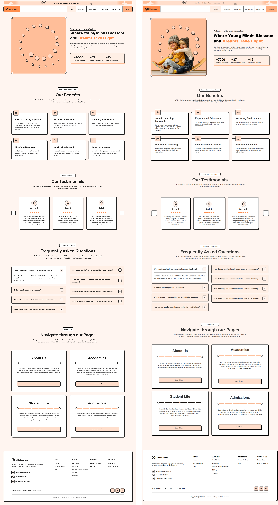

# 🎓 Little Learner Academy – Frontend Webpage

Welcome to **Little Learner Academy**, interactive single-page educational website built using **HTML**, **CSS**, and **Vanilla JavaScript**.

This project is ideal for showcasing an educational service or online learning platform. It includes smooth interactions and clean design tailored for a modern learning experience.

---

## 📚 Sections Overview

The webpage includes the following sections:

1. **🔝 Header** – Logo and navigation
2. **🌟 Hero** – Eye-catching intro with call-to-action
3. **🎯 Benefits** – Key features and advantages
4. **🗣 Testimonials** – Horizontally scrollable customer feedback carousel
5. **❓ FAQ** – Click-to-toggle accordion with plus/minus icons
6. **🔻 Footer** – Contact and basic info

---

## 🌐 Technologies Used

- ✅ **HTML5** – Semantic structure
- ✅ **CSS** – Styling
- ✅ **JavaScript (Vanilla)** – Interactive behavior

---

## 📁 Folder Structure

```
Little_Learners_web
├── assets
│   ├── icons
│   └── images
├── css
│   └── style.css
├── js
│   └── script.js
├── .gitignore
├── figma-design-development-state-comparison.png
├── index.html
└── README.md

```

---

## 📸 Preview Design vs Development

> 

---

## 🚀 Getting Started

To run this project locally:

1. Clone the repository or download the ZIP  
2. Open `index.html` in any modern browser

> 💡 No build tools or npm required. Just a browser.

---

## 🧩 Features

### ✅ Hero Section
A welcoming section with a call-to-action button and a learning-related illustration.

### ✅ Benefits
Highlights 3 core benefits using responsive cards with icons and descriptions.

### ✅ Testimonials Carousel
- Scrollable horizontally
- Uses JavaScript `scrollBy()` for smooth transitions
- Navigation via left/right arrow buttons

### ✅ FAQ Accordion
- Uses JavaScript to toggle visibility
- Dynamic plus/minus icons based on state
- Only one question expands at a time

---

## 📜 Code Highlights

### JavaScript Behavior

- Smooth horizontal scroll for testimonials:
```js
container.scrollBy({ left: scrollAmount, behavior: "smooth" });
```

- Toggle FAQ item:
```js
item.classList.toggle("active");
toggle.src = isActive ? "./assets/icons/minus.png" : "./assets/icons/plus.png";
```

---

## 👨‍🎓 Ideal For

- Educational Websites  

---

## 🙌 Credits

For demo purposes under the name **Little Learner Academy**
